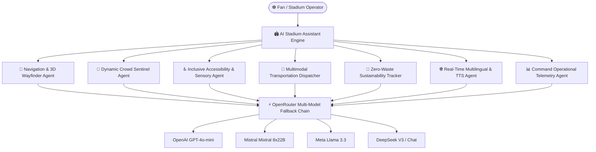

<div align="center">

# 🏟️ AI Stadium Assistant
### Complete Autonomous AI-Powered Stadium Operations & Fan Experience Platform
**FIFA World Cup 2026™ Edition**

<br/>

&nbsp;
&nbsp;
&nbsp;
&nbsp;


<br/><br/>

</div>

---

## 🌟 Overview

**AI Stadium Assistant** is an enterprise-grade, autonomous multi-agent platform designed for the **FIFA World Cup 2026**. Built with **CrewAI**, **OpenRouter Multi-Model Routing**, and **Flask**, it orchestrates 7 specialized AI agents to deliver real-time stadium navigation, crowd density management, 100% inclusive accessibility, multimodal transit guidance, sustainability metrics, instant multilingual voice translation, and command-level operational intelligence.

---

## 🤖 The 7 Autonomous AI Agents



1. **🧭 Smart Wayfinder & Seat Navigator**: Turn-by-turn route guidance to seats, gates, elevators, and amenities with exact walking duration and accessibility options.
2. **👥 Dynamic Crowd Sentinel**: Live concourse crowd density analytics, turnstile throughput telemetry, bottleneck evasion, and emergency egress routing.
3. **♿ Inclusive Accessibility Concierge**: Step-free ramp locator, priority elevator audio cues, Braille routes, and sensory calm pod reservations (Suite 104).
4. **🚌 Multimodal Transit Dispatcher**: Real-time Metro Line 1 departures, express park-and-ride shuttle status, rideshare pickup bays, and post-match traffic clearance.
5. **🌱 Zero-Waste & Green Stadium Tracker**: Water refill station locator, stadium solar canopy telemetry (1.4 MW), compostable concession packaging, and fan eco-rewards.
6. **🌐 Real-Time Multilingual Speech & Text Agent**: Speech recognition input and text-to-speech audio synthesis across 10 languages (EN, ES, FR, DE, PT, AR, HI, ZH, JA, KO).
7. **📊 Matchday Operational Command Telemetry**: Concourse flow telemetry, turnstile wait dissipation pacing, and automated medical/security marshal dispatch.

---

## ⚡ Multi-Model Intelligence & Fallback Chain

| Agent Service | Primary AI Model | Auto-Fallback Model | Specialization |
|---|---|---|---|
| **Wayfinder & Navigation** | `openai/gpt-4o-mini` | `mistralai/mixtral-8x22b` | Spatial logic, step-by-step pathing |
| **Crowd Sentinel** | `mistralai/mixtral-8x22b` | `meta-llama/llama-3.3-70b` | Density calculations, bottleneck risk |
| **Accessibility Concierge** | `meta-llama/llama-3.3-70b` | `openai/gpt-4o-mini` | ADA compliance, sensory guidelines |
| **Transit Dispatcher** | `deepseek/deepseek-chat` | `openai/gpt-4o-mini` | Route optimization, shuttle ETAs |
| **Green Tracker** | `openai/gpt-4o-mini` | `mistralai/mixtral-8x22b` | Solar metrics, carbon offset analytics |
| **Multilingual Voice** | `mistralai/mixtral-8x22b` | `openai/gpt-4o-mini` | High-fidelity translation & idioms |
| **Operational Telemetry** | `meta-llama/llama-3.3-70b` | `deepseek/deepseek-chat` | High-throughput telemetry synthesis |

---

## 🛠️ Project Structure

```
Stadium-AI/
├── app/
│   ├── __init__.py          # Flask app initialization
│   ├── main.py              # Blueprint routes, APIs, and sanitize handlers
│   ├── model_manager.py     # OpenRouter multi-model manager with fallback
│   ├── agents.py            # CrewAI agent declarations
│   ├── tasks.py             # CrewAI task orchestrations
│   ├── crew.py              # StadiumAICrew sequential pipeline
│   ├── models.py            # Pydantic validation schemas
│   └── utils.py             # Telemetry & helper utilities
├── public/                  # Netlify / CDN static web distribution bundle
│   ├── _redirects           # Single Page Application routing rules
│   ├── index.html           # Pre-rendered World Cup UI with Live Radar
│   ├── css/style.css        # Cyberpunk Stadium glassmorphism theme
│   └── js/script.js         # 100% functional Web Speech, TTS, & Agent Engine
├── templates/
│   └── index.html           # Flask Jinja2 template
├── static/
│   ├── css/style.css        # Production stylesheet
│   └── js/script.js         # Frontend interactive controller
├── .python-version          # Python 3.11 runtime lock
├── runtime.txt              # Cloud build runtime configuration
├── netlify.toml             # Netlify deployment configuration
├── requirements.txt         # Modern pinned dependencies with prebuilt wheels
├── run.py                   # Application entrypoint
└── README.md                # Project documentation
```

---

## 🚀 Quickstart & Local Installation

### Prerequisites
- Python 3.10 - 3.13 (Recommended: **Python 3.11.9**)
- Git

### 1. Clone & Setup Virtual Environment
```bash
git clone https://github.com/alokinfo30/Stadium-AI.git
cd Stadium-AI

python -m venv venv
# On Windows PowerShell:
.\venv\Scripts\Activate.ps1
# On Linux/macOS:
source venv/bin/activate
```

### 2. Install Dependencies
```bash
pip install -r requirements.txt
```

### 3. Configure Environment Variables
Create a `.env` file in the root directory:
```env
OPENROUTER_API_KEY=your_openrouter_api_key_here
FLASK_ENV=development
FLASK_DEBUG=1
SUPPORTED_LANGUAGES=en,es,fr,de,pt,ar,hi,zh,ja,ko
```

### 4. Launch Application
```bash
python run.py
```
Open your browser at **`http://localhost:5000`** to access the live FIFA World Cup 2026 AI Stadium Assistant.

---

## 🌐 Deploying to Production

- **Netlify / Static CDN:** Automatic zero-config deployment from `public/` directory with instant client-side AI fallback.
- **Render / Railway / Heroku:** Runs `gunicorn run:app --bind 0.0.0.0:$PORT` on Python 3.11.9.

---

## 📄 License & Credits
Developed by **[Alok Srivastava](https://github.com/alokinfo30)** for the **FIFA World Cup 2026™ AI Innovation Platform**.
