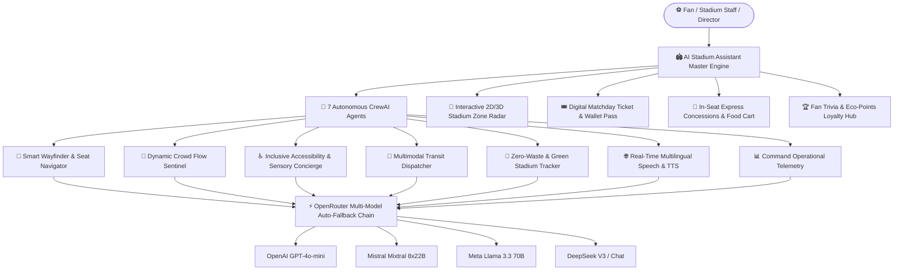

<div align="center">

# 🏟️ AI Stadium Assistant
### Complete Autonomous AI-Powered Stadium Operations & Fan Experience Platform
**FIFA World Cup 2026™ Edition**

<br/>

&nbsp;
&nbsp;
&nbsp;
&nbsp;


<br/><br/>

</div>

---

## 🌟 Overview

**AI Stadium Assistant** is a world-class, multi-agent AI operations and fan companion platform engineered for the **FIFA World Cup 2026**. Powered by **CrewAI**, **OpenRouter Multi-Model Routing**, and **Flask**, it orchestrates 7 autonomous AI agents alongside an interactive visual stadium radar, digital match ticket wallet, zero-queue mobile concessions ordering, live match telemetry, and voice AI in 10+ languages.

---

## 🚀 Key Modules & Capabilities



### 1. 🤖 7 Specialized Autonomous AI Agents
- **🧭 Smart Wayfinder & Seat Navigator**: Turn-by-turn routes to seats, restrooms, elevators, and nearest concessions with walking time estimates.
- **👥 Dynamic Crowd Sentinel**: Live concourse crowd density analytics, bottleneck evasion, turnstile dissipation pacing, and emergency egress routing.
- **♿ Inclusive Accessibility Concierge**: 100% inclusive step-free access, Braille audio cues, sensory room bookings (Suite 104), and FM 94.2 MHz audio commentary.
- **🚌 Multimodal Transit Dispatcher**: Live Metro Line 1 departures, park-and-ride shuttle status, rideshare pickup bays, and post-match highway clearance.
- **🌱 Zero-Waste & Green Stadium Tracker**: Water refill station locator, stadium solar canopy telemetry (1,420 kWh), and fan eco-rewards.
- **🌐 Real-Time Multilingual Translator**: 10+ languages with Web Speech voice input and text-to-speech audio synthesis.
- **📊 Matchday Operational Command Telemetry**: Gate throughput, turnstile wait dissipation, and automated medical/security marshal dispatch.

### 2. 📍 Interactive Stadium Zone Radar
- Sector-by-sector live heatmap: North Concourse (Gates 1-3), East Grandstand (Gates 4-6), South Concourse (Gates 7-9), West VIP & Media (Gates 10-12), Central Food Plaza, and Sensory Pods.

### 3. 🎟️ Digital Matchday Ticket Wallet
- Interactive matchday ticket generator with live barcode simulator and 1-click guide to seat.

### 4. 🍔 Mobile Express Food Ordering
- In-seat concession ordering simulator with 2-minute express concourse pickup.

### 5. 🏆 Fan Trivia & Eco-Points Loyalty
- Interactive FIFA quiz and fan points calculator redeemable for carbon offset badges.

---

## ⚡ Multi-Model Intelligence Matrix

| Agent Service | Primary AI Model | Auto-Fallback Model | Specialization |
|---|---|---|---|
| **Wayfinder & Navigation** | `openai/gpt-4o-mini` | `mistralai/mixtral-8x22b` | Spatial logic, step-by-step pathing |
| **Crowd Sentinel** | `mistralai/mixtral-8x22b` | `meta-llama/llama-3.3-70b` | Density calculations, bottleneck risk |
| **Accessibility Concierge** | `meta-llama/llama-3.3-70b` | `openai/gpt-4o-mini` | ADA compliance, sensory guidelines |
| **Transit Dispatcher** | `deepseek/deepseek-chat` | `openai/gpt-4o-mini` | Route optimization, shuttle ETAs |
| **Green Tracker** | `openai/gpt-4o-mini` | `mistralai/mixtral-8x22b` | Solar metrics, carbon offset analytics |
| **Multilingual Voice** | `mistralai/mixtral-8x22b` | `openai/gpt-4o-mini` | High-fidelity translation & idioms |
| **Operational Telemetry** | `meta-llama/llama-3.3-70b` | `deepseek/deepseek-chat` | High-throughput telemetry synthesis |

---

## 🚀 Quickstart & Local Installation

### Prerequisites
- Python 3.10 - 3.13 (Recommended: **Python 3.11.9**)
- Git

### 1. Clone & Setup Environment
```bash
git clone https://github.com/alokinfo30/Stadium-AI.git
cd Stadium-AI

python -m venv venv
# On Windows PowerShell:
.\venv\Scripts\Activate.ps1
# On Linux/macOS:
source venv/bin/activate
```

### 2. Install Dependencies
```bash
pip install -r requirements.txt
```

### 3. Configure Environment Variables
Create a `.env` file in the root directory:
```env
OPENROUTER_API_KEY=your_openrouter_api_key_here
FLASK_ENV=development
FLASK_DEBUG=1
SUPPORTED_LANGUAGES=en,es,fr,de,pt,ar,hi,zh,ja,ko
```

### 4. Launch Application
```bash
python run.py
```
Open **`http://localhost:5000`** in your browser.

---

## 🌐 Production Deployment

- **Netlify / Static CDN:** Zero-config deployment from `public/` directory with instant client-side AI fallback.
- **Render / Railway / Heroku:** Runs `gunicorn run:app --bind 0.0.0.0:$PORT` on Python 3.11.9.

---

## 📄 License & Credits
Developed by **[Alok Srivastava](https://github.com/alokinfo30)** for the **FIFA World Cup 2026™ AI Innovation Platform**.
